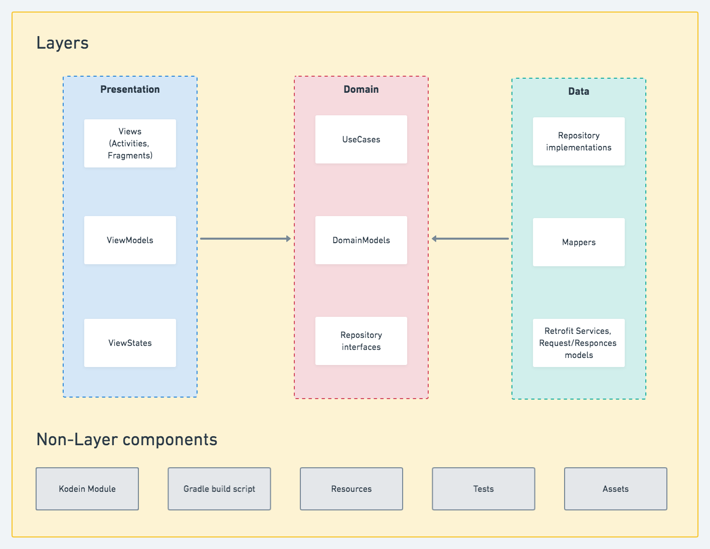
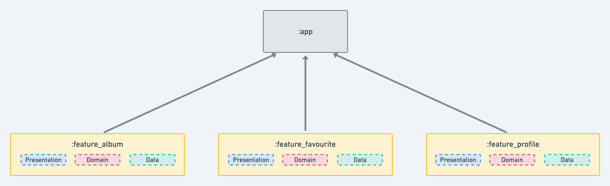

## Arquitectura completa

## Arquitectura por feature

Se trata de crear cada feature por separado para que al momento de aprender compose sea mucho 
mas facil la separacion por fragments o como esta de moda (Widgets) y de esta manera 
reutilzar la mayor cantidad de código posible